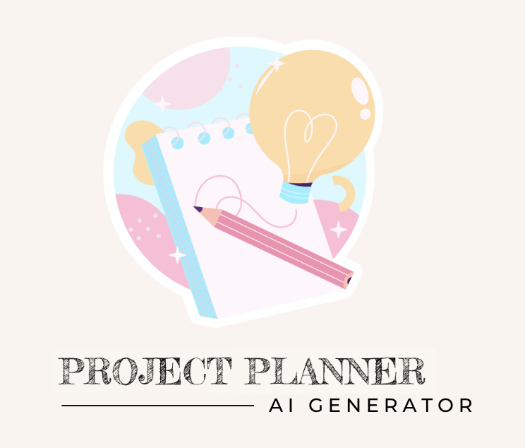

  <!-- Improved compatibility of back to top link: See: https://github.com/othneildrew/Best-README-Template/pull/73 -->
<a name="readme-top"></a>
<!--
*** Thanks for checking out the Best-README-Template. If you have a suggestion
*** that would make this better, please fork the repo and create a pull request
*** or simply open an issue with the tag "enhancement".
*** Don't forget to give the project a star!
*** Thanks again! Now go create something AMAZING! :D
-->

<!-- PROJECT SHIELDS -->
<!--
*** I'm using markdown "reference style" links for readability.
*** Reference links are enclosed in brackets [ ] instead of parentheses ( ).
*** See the bottom of this document for the declaration of the reference variables
*** for contributors-url, forks-url, etc. This is an optional, concise syntax you may use.
*** https://www.markdownguide.org/basic-syntax/#reference-style-links
-->
[![Contributors][contributors-shield]][contributors-url]
[![Forks][forks-shield]][forks-url]
[![Stargazers][stars-shield]][stars-url]
[![Issues][issues-shield]][issues-url]
[![MIT License][license-shield]][license-url]

<!-- PROJECT LOGO -->
<br />
<div align="center">
  <a href="https://github.com/AI-Project-Planner/project_planner_be">
    
  </a>

<h2 align="center">AI Project Planner</h2>

  <p align="center">
    An api for users to generate everything needed for their next software development project!
    <!-- <br />
    <a href="https://github.com/AI-Project-Planner/project_planner_be"><strong>Explore the docs »</strong></a>
    <br />
    <br />
    <a href="https://github.com/AI-Project-Planner/project_planner_be">View Demo</a>
    ·
    <a href="https://github.com/AI-Project-Planner/project_planner_be/issues">Report Bug</a>
    ·
    <a href="https://github.com/AI-Project-Planner/project_planner_be/issues">Request Feature</a>
  </p> -->
</div>

<!-- TABLE OF CONTENTS -->
<!-- <details> -->
  <summary>Table of Contents</summary>
  <ol>
    <li>
      <a href="#about-the-project">About The Project</a>
      <ul>
        <li><a href="#built-with">Built With</a></li>
      </ul>
    </li>
    <li>
      <a href="#getting-started">Getting Started</a>
      <ul>
        <li><a href="#prerequisites">Prerequisites</a></li>
        <li><a href="#installation">Installation</a></li>
      </ul>
    </li>
    <li><a href="#usage">Usage</a></li>
      <ul>
        <li><a href="#endpoints">Restful Endpoints</a></li>
      </ul>
    <li><a href="#roadmap">Roadmap</a></li>
    <li><a href="#contributing">Contributing</a></li>
    <li><a href="#license">License</a></li>
    <li><a href="#contact">Contact</a></li>
    <li><a href="#acknowledgments">Acknowledgments</a></li>
  </ol>
</details>

<!-- ABOUT THE PROJECT -->
## About The Project
Project Planner is designed to streamline the project planning process for junior to mid level developers. By leveraging advanced AI technology, this app assists users in crafting comprehensive project plans and generating innovative ideas tailored to their chosen project type and preferred technologies.<br>[Project Spec/Requirements](https://mod4.turing.edu/projects/capstone/)

![Project Planner Screenshot][giphy1]
![Project Planner Screenshot][giphy2]
![Project Planner Screenshot][giphy3]


### Deployed UI
- [Frontend Deployment]()
- [Frontend Repository](https://github.com/AI-Project-Planner/project-planner-ui)

<p align="right">(<a href="#readme-top">back to top</a>)</p>

### Built With


[](https://github.com/astral-sh/ruff)
[](https://pypi.python.org/pypi/ruff)
[](https://circleci.com/docs/)
[Readme Template](https://github.com/othneildrew/Best-README-Template)

<p align="right">(<a href="#readme-top">back to top</a>)</p>

<!-- GETTING STARTED -->
## Getting Started

Ensure you have the following installed prior to installing the Project Planner App:

### Prerequisites

* Python 3.11.4
* Django-Admin 4.2.4
* Postgresql 14
* pip 23.2.1


### Installation

Follow these steps to install the Project Planner App:

<details close><br>

1. Get an API Key and/or Application Keys at:
    [OpenAI API](https://openai.com/product)

1. Fork or clone a copy of this repo, then run the following commands from the project directory in your terminal:

    ```zsh
    git clone https://github.com/AI-Project-Planner/project_planner_be.git
    ```

1. Navigate to the project directory:

    ```zsh
    cd project_planner_be
    ```

1. Create a virtual environment (optional but recommended):

    ```zsh
    python3 -m venv env
    ```

1. Activate the virtual environment:

    - macOS/Linux:

        ```zsh
        source env/bin/activate
        ```

    - Windows:

        ```zsh
        source env/Scripts/activate
        ```

1. Install the required environment packages:

    ```zsh
    pip install -r requirements.txt
    ```

1. Run migrations:

    ```zsh
    python3 manage.py makemigrations
    python3 manage.py migrate
    ```

1. Run test suite to ensure functionality is working.

    ```zsh
    python3 manage.py test
    ```

1. If any modules are missing:

    ```zsh
    pip install < MISSING MODULE >
    ```


1. Start the development server:

    ```zsh
    python3 manage.py runserver
    ```

    1. The server should start running at http://127.0.0.1:8000/

1. Enter your Keys in `.env`

    ```yml
    SECRET_KEY: <your_django_secret_key>
    OPEN_API_KEY: <open_ai_api_key>
    ```

</details>
<p align="right">(<a href="#readme-top">back to top</a>)</p>

<!-- USAGE EXAMPLES -->
## Usage

### Endpoints
<details close>

### Generate a Project
<details close>

```http
POST /api/v1/users/:id/projects
```

#### Parameters

```
:id => user_id
```

| Code | Description |
| :--- | :---------- |
| 200  | `OK`        |

#### Request Body

```json
{
	"type": "frontend",
	"technologies": "react, typescript and javascript",
	"time": "1 week",
	"collaborators": 2
}
```

#### Example Response

```json
{
	"id": "1",
	"type": "project",
	"attributes": {
		"name": "TaskMaster Pro",
		"steps": "Project Setup: Create Git repository and define project structure\nBackend Setup: Develop Express.js application, set up API routes\nDatabase Design: Design and implement database schema",
		"description": "TaskMaster Pro is an all-inclusive task management application designed to optimize team collaboration and productivity.",
	  "features": "User registration and login\nCreate, assign, update, and track tasks\nReal-time collaboration and updates\nPriority-based task categorization",
		"interactions": "User logs in to TaskMaster Pro account.\nDashboard displays tasks by priority: High, Medium, Low.\nUser adds a task, assigns it, and sets a due date.\nTask appears under the respective priority category.\nAssigned user starts task, status updates in real-time.\nUpon completion, task is marked as done and updates for all.",
		"colors": "#3498DB\n#27AE60\n#F39C12\n#F0F3F4\n#333333\n#E74C3C",
		"saved": false,
		"timeline": "week",
    "timeline_int": 1,
		"user_id": "1"
	}
}
```

##### Error Response

| Code | Description |
| :--- | :---------- |
| 503  | `Server is down.` |

```json
	{
		"Error": "Server is down.",
		"Status": 500
	}
```

</details>

### Update Saved Status for A Users Project

<details close>

```http
PATCH /api/v1/users/:user_id/projects/:project_id/
```

#### Parameters

```
:user_id => user_id
:project_id => project_id
```

| Code | Description |
| :--- | :---------- |
| 202  | `ACCEPTED`        |

#### Request Body

```json
{
	"saved": "true"
}
```

#### Example Response

```json
{
	"id": "1",
	"type": "project",
	"attributes": {
    "user_id": 1,
		"name": "TaskMaster Pro",
		"steps": "Project Setup: Create Git repository and define project structure\nBackend Setup: Develop Express.js application, set up API routes\nDatabase Design: Design and implement database schema",
		"description": "TaskMaster Pro is an all-inclusive task management application designed to optimize team collaboration and productivity.",
	  "features": "User registration and login\nCreate, assign, update, and track tasks\nReal-time collaboration and updates\nPriority-based task categorization",
		"interactions": "User logs in to TaskMaster Pro account.\nDashboard displays tasks by priority: High, Medium, Low.\nUser adds a task, assigns it, and sets a due date.\nTask appears under the respective priority category.\nAssigned user starts task, status updates in real-time.\nUpon completion, task is marked as done and updates for all.",
		"colors": "#3498DB\n#27AE60\n#F39C12\n#F0F3F4\n#333333\n#E74C3C",
		"saved": true,
		"timeline": "week",
    "timeline_int": 1,
     "tagline": "Effortlessly manage and track tasks.",
        "collaborators": 4,
        "logo_url": "",
        "logo_font": ""
	}
}
```

##### Error Response

| Code | Description |
| :--- | :---------- |
| 404  | `Project or User ID not found.` |

```json
	{
		"Error": "Project or User ID not found.",
		"Status": 404
	}
```

</details>

### Update Attribute for A Users Project

<details close>

```http
PUT /api/v1/users/:user_id/projects/:project_id/
```

#### Parameters

```
:user_id => user_id
:project_id => project_id
```

| Code | Description |
| :--- | :---------- |
| 202  | `ACCEPTED`        |

#### Request Body

```json
{
	"collaborators": 5,
}
```

#### Example Response

```json
{
	"id": "1",
	"type": "project",
	"attributes": {
    "user_id": 1,
		"name": "TaskMaster Pro",
		"steps": "Project Setup: Create Git repository and define project structure\nBackend Setup: Develop Express.js application, set up API routes\nDatabase Design: Design and implement database schema",
		"description": "TaskMaster Pro is an all-inclusive task management application designed to optimize team collaboration and productivity.",
	  "features": "User registration and login\nCreate, assign, update, and track tasks\nReal-time collaboration and updates\nPriority-based task categorization",
		"interactions": "User logs in to TaskMaster Pro account.\nDashboard displays tasks by priority: High, Medium, Low.\nUser adds a task, assigns it, and sets a due date.\nTask appears under the respective priority category.\nAssigned user starts task, status updates in real-time.\nUpon completion, task is marked as done and updates for all.",
		"colors": "#3498DB\n#27AE60\n#F39C12\n#F0F3F4\n#333333\n#E74C3C",
		"saved": true,
		"timeline": "week",
    "timeline_int": 1,
     "tagline": "Effortlessly manage and track tasks.",
        "collaborators": 5,
        "logo_url": "",
        "logo_font": ""
	}
}
```

##### Error Response

| Code | Description |
| :--- | :---------- |
| 404  | `Project or User ID not found.` |

```json
	{
		"Error": "Project or User ID not found.",
		"Status": 404
	}
```
</details>


### Get ALL of a Users Projects

<details close>

```http
GET /api/v1/users/:id/projects/
```

#### Parameters:

```
:id => user_id
```

| Code | Description |
| :--- | :---------- |
| 200  | `OK`        |


#### Example Response:

```json
{
  "data":
  [
    {
      "id": "1",
      "type": "project",
      "attributes": {
        "user_id": 1,
        "name": "TaskMaster Pro",
        "steps": "Project Setup: Create Git repository and define project structure\nBackend Setup: Develop Express.js application, set up API routes\nDatabase Design: Design and implement database schema",
        "description": "TaskMaster Pro is an all-inclusive task management application designed to optimize team collaboration and productivity.",
        "features": "User registration and login\nCreate, assign, update, and track tasks\nReal-time collaboration and updates\nPriority-based task categorization",
        "interactions": "User logs in to TaskMaster Pro account.\nDashboard displays tasks by priority: High, Medium, Low.\nUser adds a task, assigns it, and sets a due date.\nTask appears under the respective priority category.\nAssigned user starts task, status updates in real-time.\nUpon completion, task is marked as done and updates for all.",
        "colors": "#3498DB\n#27AE60\n#F39C12\n#F0F3F4\n#333333\n#E74C3C",
        "timeline": "week",
        "timeline_int": 1,
        "saved": true,
        "tagline": "Effortlessly manage and track tasks.",
        "collaborators": 4,
        "logo_url": "",
        "logo_font": ""
      }
    },
    {
      "id": "2",
      "type": "project",
      "attributes": {
        "user_id": 1,
        "name": "Different Project Pro",
        "steps": "Project Setup: Create Git repository and define project structure\nBackend Setup: Develop Express.js application, set up API routes\nDatabase Design: Design and implement database schema",
        "description": "It's different!",
        "features": "User registration and login\nCreate, assign, update, and track tasks\nReal-time collaboration and updates\nPriority-based task categorization",
        "interactions": "User logs in to TaskMaster Pro account.\nDashboard displays tasks by priority: High, Medium, Low.\nUser adds a task, assigns it, and sets a due date.\nTask appears under the respective priority category.\nAssigned user starts task, status updates in real-time.\nUpon completion, task is marked as done and updates for all.",
        "colors": "#3498DB\n#27AE60\n#F39C12\n#F0F3F4\n#333333\n#E74C3C",
        "saved": true,
        "timeline": "days",
        "timeline_int": 4,
        "tagline": "Manage and track tasks differently.",
        "collaborators": 4,
        "logo_url": "",
        "logo_font": ""
      }
    }
  ]
}
```

Error Response:

| Code | Description |
| :--- | :---------- |
| 404  | `User ID not found.` |

```json
{
  "Error": "User ID not found.",
  "Status": 404
}
```

</details>

### Delete A User's Project

<details close>

```http
DELETE /api/v1/users/:user_id/projects/:project_id/
```

#### Parameters

```
:user_id => user_id
:project_id => project_id
```

| Code | Description |
| :--- | :---------- |
| 200  | `SUCCESSFUL`        |


#### Example Response

```json
{
	"messages": "Project with id " {project_id} + " was deleted."
}
``````
##### Error Response

| Code | Description |
| :--- | :---------- |
| 404  | `Project or User ID not found.` |

```json
	{
		"Error": "Project or User ID not found.",
		"Status": 404
	}
```
</details>

<p align="right">(<a href="#readme-top">back to top</a>)</p> 

<!-- ROADMAP -->
<!-- ## Roadmap

- [ ] Logo Generation using DALL-E from OpenAI
- [ ] Add update and delete functionality for projects
- [ ] Add an endpoint to GET all users
- [ ] Allow users to login using Oauth through Github

See the [open issues](https://github.com/AI-Project-Planner/project_planner_be/issues) for a full list of proposed features (and known issues).

<p align="right">(<a href="#readme-top">back to top</a>)</p>

<!-- CONTRIBUTING -->
## Contributing

Contributions are what make the open source community such an amazing place to learn, inspire, and create. Any contributions you make are **greatly appreciated**.

If you have a suggestion that would make this better, please fork the repo and create a pull request. You can also simply open an issue with the tag "enhancement".
Don't forget to give the project a star! Thanks again!

1. Fork the Project
2. Follow Installation Instructions
2. Create your Feature Branch (`git checkout -b feature/AmazingFeature`)
3. Commit your Changes (`git commit -m 'Add some AmazingFeature'`)
4. Push to the Branch (`git push origin feature/AmazingFeature`)
5. Open a Pull Request

<p align="right">(<a href="#readme-top">back to top</a>)</p>

<!-- LICENSE -->
## License

Distributed under the MIT License. See `LICENSE.txt` for more information.

<p align="right">(<a href="#readme-top">back to top</a>)</p>

<!-- CONTACT -->
## Contact

- Amy Marie Spears [![LinkedIn][linkedin-shield]][linkedin-url-as] [![GitHub][github-shield]][github-url-as]
- Michael Callahan [![LinkedIn][linkedin-shield]][linkedin-url-mc] [![GitHub][github-shield]][github-url-mc]
- Javen Wilson [![LinkedIn][linkedin-shield]][linkedin-url-jw] [![GitHub][github-shield]][github-url-jw]
- Garrett Gregor [![LinkedIn][linkedin-shield]][linkedin-url-gg] [![GitHub][github-shield]][github-url-gg]

Project Link: [https://github.com/AI-Project-Planner/project_planner_be](https://github.com/AI-Project-Planner/project_planner_be)

<p align="right">(<a href="#readme-top">back to top</a>)</p>

<!-- ACKNOWLEDGMENTS -->
## Acknowledgments

Our wonderful Front End Team!!
- Saki [![GitHub][github-shield]][github-url-sc]
- Laura [![GitHub][github-shield]][github-url-lg]
- Fernando [![GitHub][github-shield]][github-url-fr]

Our amazing instructors:
- [Leta](https://github.com/letakeane)
- [Erin Pintozzi](https://github.com/epintozzi)

<p align="right">(<a href="#readme-top">back to top</a>)</p>

<!-- MARKDOWN LINKS & IMAGES -->
<!-- https://www.markdownguide.org/basic-syntax/#reference-style-links -->
[contributors-shield]: https://img.shields.io/github/contributors/AI-Project-Planner/project_planner_be.svg?style=for-the-badge
[contributors-url]: https://github.com/AI-Project-Planner/project_planner_be/graphs/contributors
[forks-shield]: https://img.shields.io/github/forks/AI-Project-Planner/project_planner_be.svg?style=for-the-badge
[forks-url]: https://github.com/AI-Project-Planner/project_planner_be/network/members
[stars-shield]: https://img.shields.io/github/stars/AI-Project-Planner/project_planner_be.svg?style=for-the-badge
[stars-url]: https://github.com/AI-Project-Planner/project_planner_be/stargazers
[issues-shield]: https://img.shields.io/github/issues/AI-Project-Planner/project_planner_be.svg?style=for-the-badge
[issues-url]: https://github.com/AI-Project-Planner/project_planner_be/issues
[license-shield]: https://img.shields.io/github/license/AI-Project-Planner/project_planner_be.svg?style=for-the-badge
[license-url]: https://github.com/AI-Project-Planner/project_planner_be/blob/master/LICENSE.txt
[github-shield]: https://img.shields.io/badge/GitHub-100000?style=for-the-badge&logo=github&logoColor=white
[github-url-gg]: https://github.com/garrettgregor
[github-url-mc]: https://github.com/calforcal
[github-url-jw]: https://github.com/javenb022
[github-url-as]: https://github.com/amspears007
[github-url-lg]: https://github.com/lauraguerra1
[github-url-fr]: https://github.com/fernandorobles97
[github-url-sc]: https://github.com/sakisandrac
[linkedin-shield]: https://img.shields.io/badge/-LinkedIn-black.svg?style=for-the-badge&logo=linkedin&colorB=555
[linkedin-url-gg]: https://linkedin.com/in/garrett-gregor
[linkedin-url-as]: https://linkedin.com/in/garrett-gregor
[linkedin-url-mc]: https://linkedin.com/in/garrett-gregor
[linkedin-url-jw]: https://linkedin.com/in/garrett-gregor
[screenshot1]: images/screenshot.png
[screenshot2]: images/schreenshot2.png
[logo]: images/logo.png
[unsplash]: images/project-planner.jpeg
[inspo]: images/planner.png
[giphy1]: images/project1.gif
[giphy2]: images/project2.gif
[giphy3]: images/project3.gif
[Next.js]: https://img.shields.io/badge/next.js-000000?style=for-the-badge&logo=nextdotjs&logoColor=white
[Next-url]: https://nextjs.org/
[React.js]: https://img.shields.io/badge/React-20232A?style=for-the-badge&logo=react&logoColor=61DAFB
[React-url]: https://reactjs.org/
[Vue.js]: https://img.shields.io/badge/Vue.js-35495E?style=for-the-badge&logo=vuedotjs&logoColor=4FC08D
[Vue-url]: https://vuejs.org/
[Angular.io]: https://img.shields.io/badge/Angular-DD0031?style=for-the-badge&logo=angular&logoColor=white
[Angular-url]: https://angular.io/
[Svelte.dev]: https://img.shields.io/badge/Svelte-4A4A55?style=for-the-badge&logo=svelte&logoColor=FF3E00
[Svelte-url]: https://svelte.dev/
[Laravel.com]: https://img.shields.io/badge/Laravel-FF2D20?style=for-the-badge&logo=laravel&logoColor=white
[Laravel-url]: https://laravel.com
[Bootstrap.com]: https://img.shields.io/badge/Bootstrap-563D7C?style=for-the-badge&logo=bootstrap&logoColor=white
[Bootstrap-url]: https://getbootstrap.com
[JQuery.com]: https://img.shields.io/badge/jQuery-0769AD?style=for-the-badge&logo=jquery&logoColor=white
[JQuery-url]: https://jquery.com
[Postgresql.com]: https://www.postgresql.org/
[Postrgresql-url]: https://img.shields.io/badge/PostgreSQL-316192?style=for-the-badge&logo=postgresql&logoColor=white